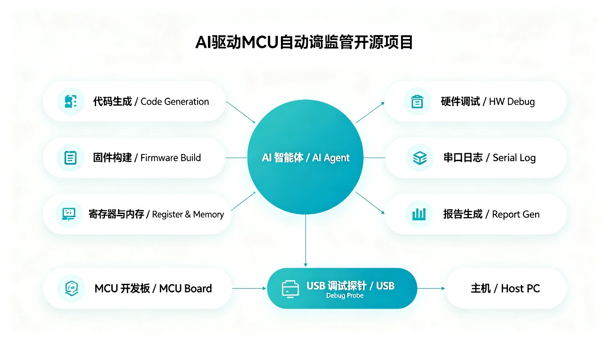
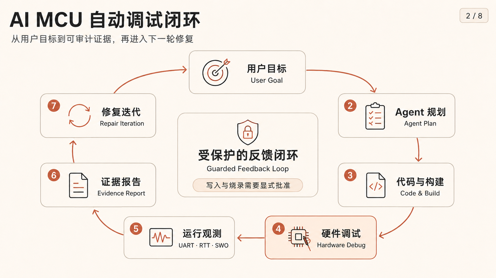
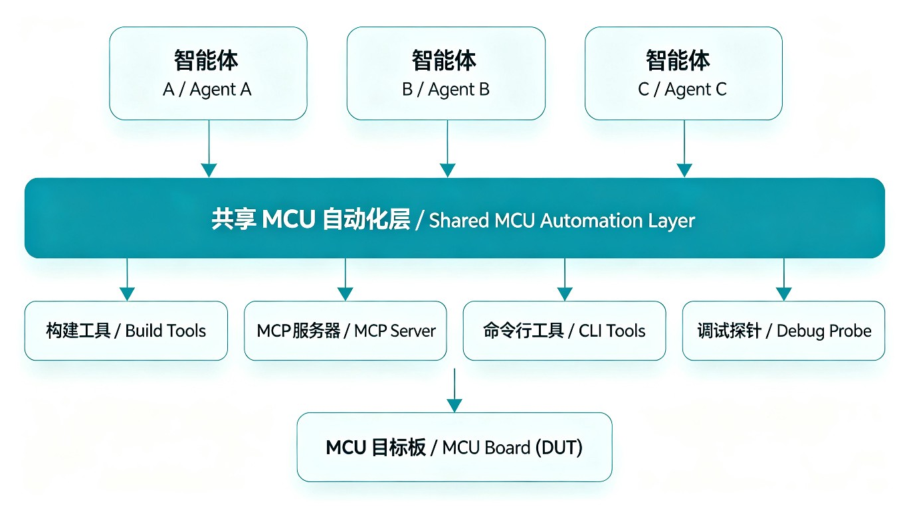
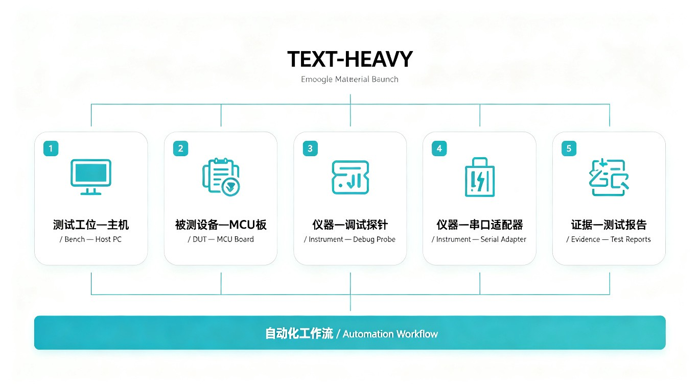
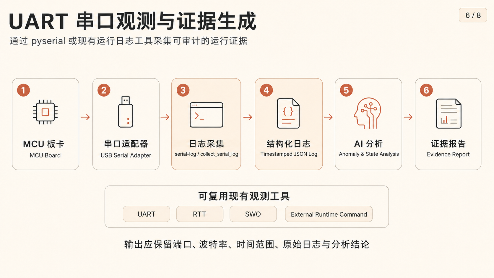

# AI MCU Auto Debug

[](LICENSE)
[](pyproject.toml)



AI MCU Auto Debug is an open-source automation toolchain for AI agents that need to write, build, flash, debug, observe, and report on MCU firmware. It keeps the core low-coupling: existing build tools, OpenOCD/J-Link/pyOCD/probe-rs style debuggers, CMSIS-SVD/user-provided documents, UART logs, CLI, MCP, and skills are connected through small deterministic adapters.

AI MCU Auto Debug 是一个面向 AI agent 的开源 MCU 自动化工具链，用来完成代码编写、构建、烧录、调试、观测和报告闭环。项目保持低耦合：复用现有构建工具、OpenOCD/J-Link/pyOCD/probe-rs 调试后端、CMSIS-SVD/用户提供资料、UART 日志、CLI、MCP 和 skill，而不是把所有东西绑死在一个平台里。

> Images in this repository are AI-generated illustrative assets. They do not represent a specific vendor board, probe, or certification.
>
> 仓库图片为 AI 生成的说明性素材，不代表某个具体厂商开发板、探针或认证。

## Quick Start / 快速开始

Give this repository URL to an AI coding agent, then ask it to run the safe bootstrap first.

把仓库地址发给 AI 编程工具后，让它先执行安全部署检查。

```powershell
git clone https://github.com/yukina0079/ai-mcu-auto-debug.git
cd ai-mcu-auto-debug
python -m venv .venv
.\.venv\Scripts\Activate.ps1
python -m pip install -e .
ai-mcu-debug agent-bootstrap --project . --client generic-json
ai-mcu-debug doctor
ai-mcu-debug capability-audit --project .
```

Recommended first prompt for Codex, Claude, OpenCode, Trae, Qoder, or another vibe coding agent:

推荐给 Codex、Claude、OpenCode、Trae、Qoder 或其他 vibe coding 工具的第一句话：

```text
Use this repository as an AI MCU automation toolchain. Run agent-bootstrap first, then use workflow-plan before hardware actions. Do not flash, repair, force writes, or run parallel hardware debug sessions unless I explicitly approve the current board and operation.
```

```text
把这个仓库当作 AI MCU 自动化工具链使用。先运行 agent-bootstrap，再用 workflow-plan 判断下一步。除非我明确批准当前板卡和操作，否则不要烧录、修复代码、强制写入，也不要并行运行硬件调试会话。
```

## What It Automates / 自动化能力



- Natural-language loop: user goal -> agent plan -> code/build -> hardware debug -> UART observation -> evidence report -> repair iteration.
- 自然语言闭环：用户目标 -> agent 规划 -> 写代码/构建 -> 硬件调试 -> UART 观测 -> 证据报告 -> 修复迭代。
- Debug control: reset/halt, breakpoints, single-step, core register reads, guarded peripheral register access, memory reads, debug sequences.
- 调试控制：reset/halt、断点、单步、核心寄存器读取、受保护的外设寄存器访问、内存读取和调试序列。
- Knowledge guard and anti-hallucination: build `mcu_context.json` from user-provided SVD, linker/startup files, datasheets, reference manuals, errata, or document repositories.
- 知识库防幻觉：从用户提供的 SVD、linker/startup、datasheet、reference manual、errata 或资料仓库生成 `mcu_context.json`。
- Signal observation: `runtime-log` wraps existing UART/RTT/SWO tools, and `serial-log` / MCP `collect_serial_log` can read UART through pyserial.
- 信号观测：`runtime-log` 复用已有 UART/RTT/SWO 工具，`serial-log` / MCP `collect_serial_log` 可通过 pyserial 读取串口。
- Agent deployment: `agent-bootstrap`, `skill-bootstrap`, `mcp-config`, and `mcp-smoke` make the repo easy to hand to different AI coding agents.
- Agent 部署：`agent-bootstrap`、`skill-bootstrap`、`mcp-config` 和 `mcp-smoke` 让不同 AI 编程工具更容易接入。

Camera/vision inspection is intentionally not shipped in the current release. It remains a future optional instrument, not a blocker for the non-vision toolchain.

当前版本不发布摄像头/视觉检测能力。它会作为未来可选 instrument，而不是非视觉工具链的阻塞项。

## Agent Compatibility / Agent 兼容



The project exposes the same capabilities through CLI, Python API, MCP tools, and a bundled skill. The goal is simple: most AI agents should be able to receive the repository URL and bootstrap themselves without private setup knowledge.

项目通过 CLI、Python API、MCP 工具和内置 skill 暴露同一套能力。目标很直接：多数 AI agent 拿到仓库地址后，应能在没有私有背景信息的情况下自行完成部署检查。

```powershell
ai-mcu-debug agent-bootstrap --client codex --project .
ai-mcu-debug agent-bootstrap --client claude-desktop --project .
ai-mcu-debug agent-bootstrap --client claude-code --project .
ai-mcu-debug agent-bootstrap --client opencode --project .
ai-mcu-debug agent-bootstrap --client trae --project .
ai-mcu-debug agent-bootstrap --client qoder --project .
ai-mcu-debug mcp-config --client generic-json --project .
ai-mcu-debug mcp-smoke --project .
```

`mcp-config` outputs verified stdio MCP snippets. For clients whose private config format is not public or stable, the tool emits a generic MCP JSON definition and points the agent back to the CLI flow instead of guessing.

`mcp-config` 会输出可检查的 stdio MCP 配置片段。对于私有配置格式不公开或不稳定的客户端，工具会输出通用 MCP JSON，并让 agent 回退到 CLI 流程，而不是乱猜配置。

## Bench, DUT, Instrument, Workflow / 核心概念



- `Bench`: a reproducible setup made of a DUT, instruments, wiring notes, workflow, and safety policy.
- `Bench`：由 DUT、仪器、接线说明、workflow 和安全策略组成的可复现实验台配置。
- `DUT`: the device under test, for example an STM32F103 board.
- `DUT`：被测设备，例如 STM32F103 开发板。
- `Instrument`: debug probe, UART adapter, runtime-log command, or future camera/signal tool.
- `Instrument`：调试探针、UART 转接器、runtime-log 命令，或未来的摄像头/信号工具。
- `Workflow`: repeatable steps such as doctor -> probe scan -> context check -> build -> serial observation -> read-only debug -> report.
- `Workflow`：可复现步骤，例如 doctor -> probe scan -> context check -> build -> serial observation -> read-only debug -> report。
- `Evidence/Report`: JSON/Markdown artifacts that another agent or engineer can replay or audit.
- `Evidence/Report`：可供另一个 agent 或工程师回放和审计的 JSON/Markdown 产物。

Start from these examples:

可以从这些示例开始：

```text
configs/benches/stm32f103_minimal.yaml
configs/boards/stm32f103rct6_daplink.yaml
configs/instruments/daplink_cmsis_dap.yaml
configs/instruments/uart_serial.yaml
configs/workflows/stm32f103_readonly_debug.yaml
configs/benches/esp32c3_supermini.yaml
configs/instruments/esp32c3_usb_serial_jtag.yaml
configs/workflows/esp32c3_supermini_readonly_debug.yaml
```

ESP32-C3 SuperMini is supported through an optional ESP-IDF backend. `doctor` discovers ESP-IDF installations managed by EIM or the VS Code extension, including Espressif OpenOCD and RISC-V GDB, without requiring them on the global `PATH`.

ESP32-C3 SuperMini 通过可选 ESP-IDF backend 接入。`doctor` 可以发现由 EIM 或 VS Code 扩展管理的 ESP-IDF、Espressif OpenOCD 和 RISC-V GDB，不要求把它们加入全局 `PATH`。

## Hardware Workflow / 硬件流程

```powershell
ai-mcu-debug resolve-chip --project . --chip STM32F103RCT6
ai-mcu-debug doc-intake --project . --chip STM32F103RCT6
ai-mcu-debug prepare-mcu --project . --chip STM32F103RCT6 --svd <device.svd> --linker <linker.ld> --startup <startup.c> --doc datasheet=<datasheet.pdf-or-md> --doc reference_manual=<reference.pdf-or-md> --doc errata=<errata.pdf-or-md> --output examples/mcu_context.json
ai-mcu-debug check-context --context examples/mcu_context.json
ai-mcu-debug init-workspace --project . --chip STM32F103RCT6 --context examples/mcu_context.json
ai-mcu-debug workflow-plan --project . --chip STM32F103RCT6
ai-mcu-debug ai-debug --mode dry-run --workspace-config .embeddedskills/config.json
ai-mcu-debug ai-debug --mode read-only --workspace-config .embeddedskills/config.json
```

Optional embedded tools on Windows:

Windows 上可选安装的嵌入式工具：

```powershell
winget install xpack-dev-tools.openocd
winget install Arm.GnuArmEmbeddedToolchain
python -m pip install pyocd pyserial
ai-mcu-debug doctor --debug-backend openocd-gdb
ai-mcu-debug probe-scan
```

UART observation example:

串口观测示例：



```powershell
ai-mcu-debug serial-log --port COM3 --baud 115200 --duration-s 5 --output debug_runs/serial/latest.json
ai-mcu-debug workflow-run --project . --chip STM32F103RCT6 --no-hardware
```

For handoff replay, keep `workflow-run --no-hardware` unless hardware access is explicitly intended; policy records this risk as `replay_workflow_run_may_touch_hardware` when the flag is absent.

handoff 回放时，除非明确要触碰硬件，否则保留 `workflow-run --no-hardware`；缺少该参数时策略会记录 `replay_workflow_run_may_touch_hardware` 风险。

## Golden Suites, Verified Boards, Reports / 公开证据


The public repo separates claims from evidence. A board is only listed as verified when there is a reproducible workflow and report artifact. Candidate boards stay marked as candidates.

公开仓库会区分“能力声明”和“证据”。只有具备可复现 workflow 与报告产物的板卡才列为 verified；候选板卡保持 candidate 标记。

- [Agent Quickstart](docs/AGENT_QUICKSTART.md)
- [Golden Suites](docs/GOLDEN_SUITES.md)
- [Verified Boards](docs/VERIFIED_BOARDS.md)
- [Reports](docs/REPORTS.md)


## Safety Policy / 安全策略

- Hardware debug sessions are exclusive per board. Do not run OpenOCD/GDB/pyOCD/J-Link/probe-rs/debug commands in parallel against the same target.
- 同一块板子的硬件调试会话必须独占。不要对同一目标并行运行 OpenOCD/GDB/pyOCD/J-Link/probe-rs/debug 命令。
- Flash, repair, force, memory writes, option bytes, clock/reset-control writes, and standalone hardware replay require explicit approval for the current board.
- 烧录、修复代码、强制操作、内存写入、option bytes、时钟/复位控制写入、独立硬件回放，都需要针对当前板卡明确批准。
- The tool asks for MCU documents or a user-provided document repository. It does not guess datasheet URLs by default.
- 工具会向用户索要 MCU 资料或用户提供的资料仓库，默认不猜 datasheet URL。
- Unknown addresses and unsafe writes are blocked unless the user intentionally overrides the guard.
- 未知地址和不安全写入会被阻止，除非用户明确要覆盖保护。

## License / 许可证

This project is open source under the [MIT License](LICENSE).

本项目基于 [MIT License](LICENSE) 开源。
