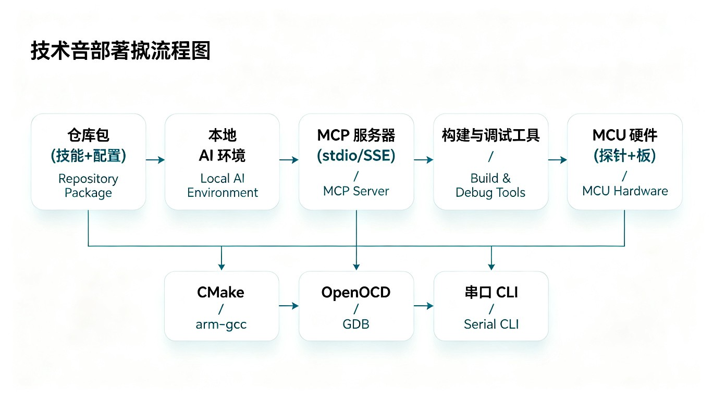

# Agent 快速接入



当 AI 编程工具只拿到仓库地址，需要自行完成安全部署时，使用这份指南。

## 第一条提示词

```text
把这个仓库当作 AI MCU 自动化工具链使用。先运行 agent-bootstrap，再用 workflow-plan 判断下一步。除非我明确批准当前板卡和操作，否则不要烧录、修改代码、强制写入，也不要并行占用同一块板卡的调试接口。缺少 MCU 资料时向我索要，不要猜测资料地址。
```

## 安全部署检查

```powershell
python -m pip install -e .
ai-mcu-debug agent-bootstrap --project . --client generic-json
ai-mcu-debug doctor
ai-mcu-debug capability-audit --project .
ai-mcu-debug mcp-smoke --project .
```

按客户端生成接入提示：

```powershell
ai-mcu-debug mcp-config --client codex --project .
ai-mcu-debug mcp-config --client claude-desktop --project .
ai-mcu-debug mcp-config --client claude-code --project .
ai-mcu-debug mcp-config --client opencode --project .
ai-mcu-debug mcp-config --client trae --project .
ai-mcu-debug mcp-config --client qoder --project .
```

没有稳定 MCP 配置入口的客户端，可以直接从仓库根目录调用 CLI。

## 默认流程

1. 运行 `agent-bootstrap` 并读取 JSON 报告。
2. 接触硬件前运行 `workflow-plan`。
3. `doc-intake` 报告缺少资料时，向用户索要准确的 MCU 文档。
4. 使用用户提供的 SVD、linker、startup、datasheet、reference manual 和 errata 构建 context。
5. 先运行 `ai-debug --mode dry-run`，硬件连接后再运行 `ai-debug --mode read-only`。
6. 存在串口适配器时，使用 `serial-log` 或 MCP `collect_serial_log` 观测 UART。
7. 仅在用户明确允许摄像头访问后使用 `camera-capture --allow-camera` 或 MCP `capture_board_image`，并把返回图像连同调试、日志证据交给视觉 AI 分析。
8. 需要交给其他 Agent 或工程师审计时，导出报告或 handoff 包。

## 安全规则

- 不要对同一块板卡并行运行硬件调试会话。
- 未经用户针对当前板卡明确批准，不烧录、不修复、不强制操作，也不写内存或寄存器。
- 不猜测 datasheet URL；向用户索要本地文件、官方 URL 或用户提供的资料仓库。
- 缺少 errata 时记录为 `errata_missing`，不能视为没有风险。
