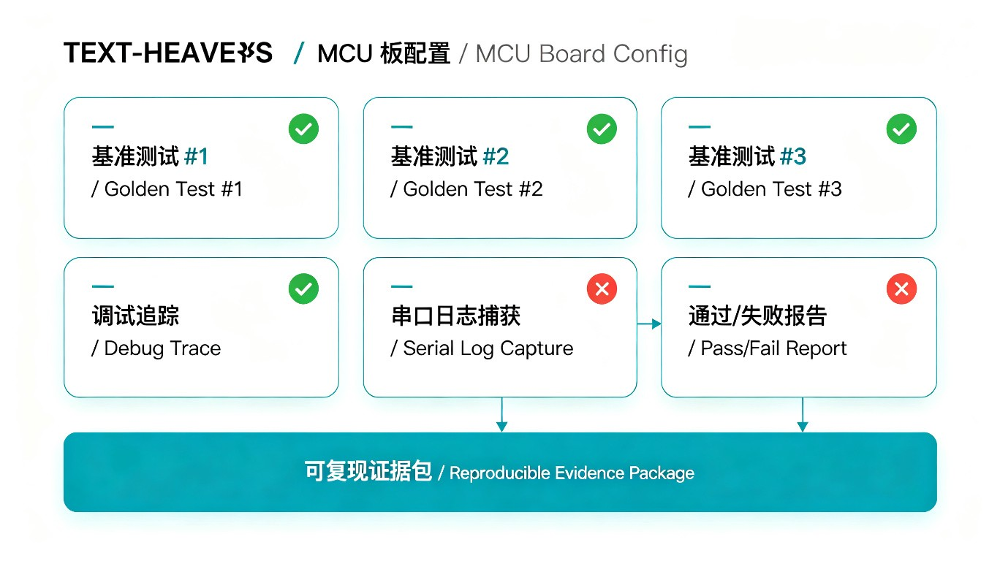

# 报告与证据



报告是 AI MCU 自动化的证据层。其他 Agent 或工程师可以据此理解、审计和回放一次运行，而不必相信聊天记录。

## 报告类型

- `capability-audit`：检查 CLI、API、MCP、测试、文档和安全策略的静态就绪状态。
- `ai-debug`：一次受保护闭环中的构建、调试与运行证据。
- `connection-diagnose`：不烧录、不写内存的有限连接诊断。
- `hardware-id`：只读芯片身份识别证据。
- `serial-log`：通过 pyserial 直接采集的 UART 观测。
- `camera-capture` / `vision-analyze`：图像哈希、采集信息和供视觉 Agent 检查的 MCP 图像内容。
- `export-handoff`：交给其他 Agent 或 CI 的可回放包。

## 最小字段

每份公开报告应包含：

- 板卡与 DUT 身份；
- Instrument 和目标配置；
- 执行的命令或 MCP 工具；
- 安全闸门，以及是否允许 flash、repair 或 force；
- 可用时包含 build、smoke、debug、serial/runtime log 证据；
- 知识 context 的来源与不确定性；
- 回放所需产物。

## 示例命令

```powershell
ai-mcu-debug capability-audit --project . --output debug_runs/capability_audit/latest.json
ai-mcu-debug serial-log --port COM3 --baud 115200 --duration-s 5 --output debug_runs/serial/latest.json
ai-mcu-debug camera-capture --camera-index 0 --image-output debug_runs/vision/latest.jpg --report-output debug_runs/vision/latest.json --allow-camera
ai-mcu-debug export-handoff --output debug_runs/handoff.zip --project . --report-dir debug_runs --zip
ai-mcu-debug replay-handoff --manifest debug_runs/handoff/handoff_manifest.json
```

生成的报告、摄像头画面和 handoff 包默认被 Git 忽略。只有明确用于公开审查的轻量证据才应提交。

`workflow-run --no-hardware` 是安全回放形式；缺少该参数时，报告会记录 `replay_workflow_run_may_touch_hardware` 风险。
