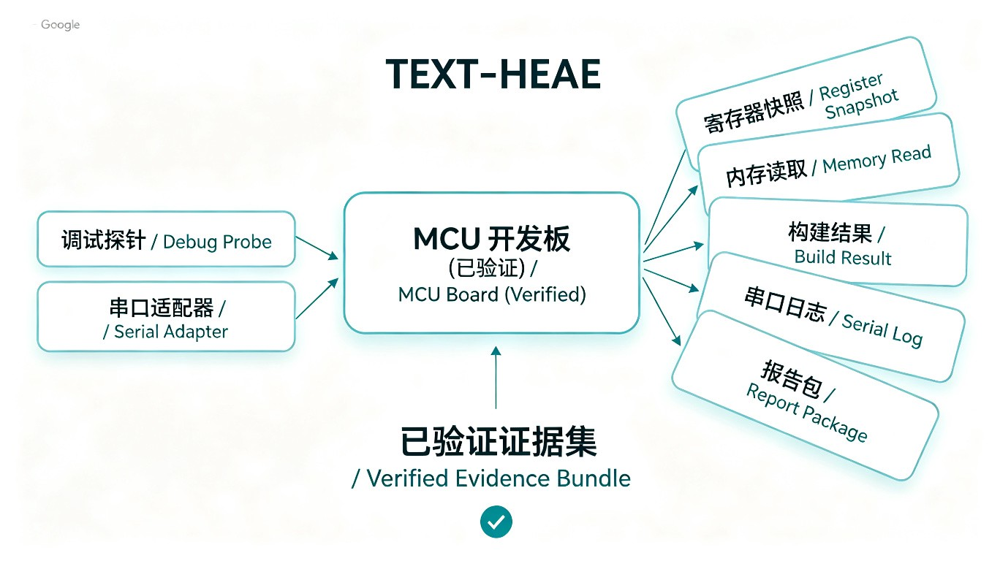

# 已验证板卡

本页区分真实验证证据与候选支持。只有仓库具备可复现 Workflow 和报告证据的板卡，才标记为 `verified`。

## 板卡矩阵

| 板卡 / DUT | 状态 | 调试 Instrument | UART 观测 | 已验证内容 |
|---|---|---|---|---|
| STM32F103RCT6 通用板 | 已验证 | DAPLink/CMSIS-DAP + OpenOCD | 可选 | Cortex-M3 与 256 KiB Flash 身份、构建、烧录校验、复位暂停、核心寄存器、RAM 读取、源码断点、单步和恢复运行。验证 Bench 未连接 NRST。 |
| ESP32-C3 SuperMini | 调试链路已验证 | 内置 USB Serial/JTAG + Espressif OpenOCD | 已验证 Bench 使用 COM13 / 115200 | 芯片身份、4 MB Flash、RISC-V 寄存器、内存读取、硬件断点、单步、恢复运行和串口日志。 |

## 验证要求

板卡从 `candidate` 提升到 `verified` 时，报告需要证明：

- 精确芯片身份和 context 来源；
- 调试探针与目标配置；
- build 和 smoke test 结果；
- 只读调试证据，适用时包含非零 PC、SP 与 xPSR；
- 来自已批准内存范围的读取证据；
- Bench 包含串口 Instrument 时的 UART 观测；
- 失败说明和不确定性，而不是静默假设。

## 当前公开状态

项目目前可以作为自动化工具链使用，但公开板卡验证保持保守。新板卡应携带可复现报告逐个加入。
